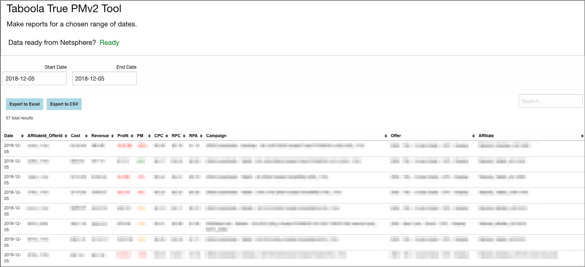
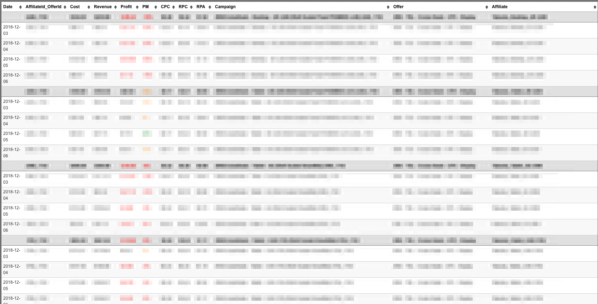
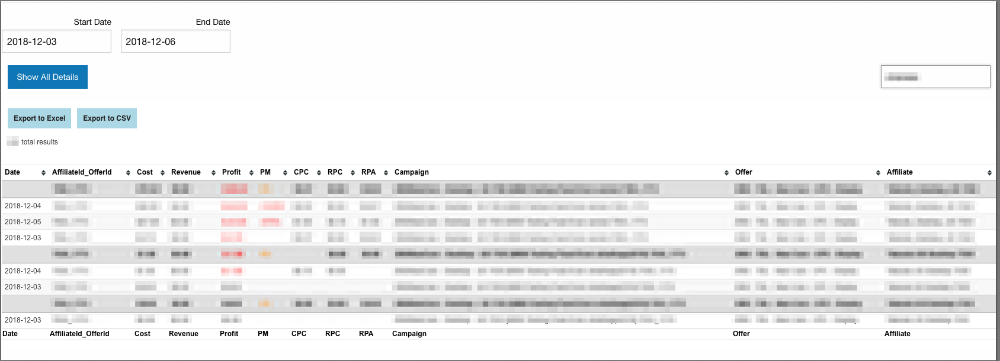

# Netsphere Taboola Tune Reports

This is an in-browser tool that pulls API data from Taboola, Tune ( aka HasOffers), and Netsphere. The end result is a smart table that functions like a pivot table in MS Excel  The table presents data for each day from each api, then offers a summary row to get a summary of how an ad campaign performs overall with the option of toggling to examine each day.  There's also an ability to see a grand summary of all the entries.  The table filters, sorts, locks sorting, and allows the data to get exported to Excel and CSV.

The application uses D3 and Mottie's Tablesorter to create a table from the data and  export it to CSV and Excel.  

## Technologies Used
* TableSorter
* D3JS
* jQuery/JavaScript
* TableExport
* HasOffers
* Netsphere
* Taboola
* Tune
* Cypress
* Foundation
* PHP

## Action Shots

## To use
This is running on a private server, however to examine the code, you would clone the repo.  Note that the main script is edited to protect information, but I have included screen shots to show how this looks in action.